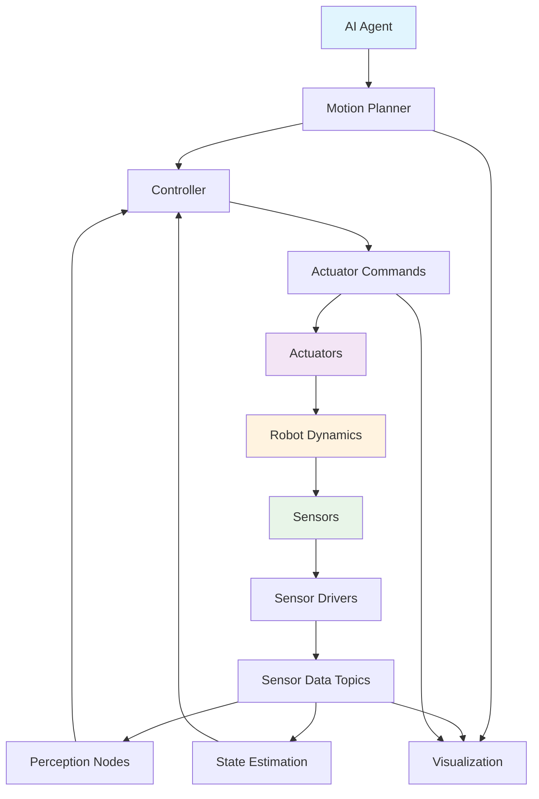

# Data Flow in Humanoid Robots

## Overview

Understanding data flow in humanoid robots is crucial for developing effective control systems. This section explores how information moves through a humanoid robot system using ROS 2 as the middleware.

## Humanoid Robot Architecture

A typical humanoid robot system consists of several interconnected subsystems:

### Sensor Subsystem
- **Proprioceptive sensors**: Joint encoders, IMU, force/torque sensors
- **Exteroceptive sensors**: Cameras, LIDAR, tactile sensors
- **Communication**: Sensor data published to topics like `/joint_states`, `/imu/data`, `/camera/image_raw`

### Control Subsystem
- **High-level planners**: Generate motion plans and trajectories
- **Low-level controllers**: Execute joint commands
- **Communication**: Plans sent via topics or services, feedback through sensor topics

### Perception Subsystem
- **Object recognition**: Identify objects in the environment
- **Localization**: Determine robot position and orientation
- **Mapping**: Create and update environment maps
- **Communication**: Results published to topics like `/perception/objects`, `/tf`, `/map`

## Data Flow Patterns

### Sensor Data Flow
```
Sensors → Sensor Drivers → /sensor_data topics → Perception/Control Nodes
```

Example flow for joint state data:
1. Joint encoders read current positions
2. Sensor driver node publishes to `/joint_states`
3. State estimation nodes subscribe to `/joint_states`
4. Control nodes use joint state information for feedback

### Control Command Flow
```
AI Agent → Motion Planner → Controller → Actuators
```

Example flow for walking:
1. AI agent decides to take a step
2. Walking pattern generator creates trajectory
3. Inverse kinematics computes joint angles
4. Joint controllers execute commands

### Feedback Loop
```
Environment → Sensors → Perception → Planning → Control → Actuators → Environment
```

## Quality of Service Considerations

### Critical Data (High Priority)
- Joint position feedback: Reliable delivery, low latency
- Emergency stop commands: Reliable delivery, highest priority
- IMU data: Best effort with high frequency

### Non-Critical Data (Lower Priority)
- Camera images: Best effort, may drop frames
- Debug information: Best effort, lower frequency
- Log messages: Best effort, low priority

## Real-World Example: Balance Control

Let's examine the data flow for maintaining balance in a humanoid robot:

### Step 1: Sensing
- IMU provides orientation and acceleration data (`/imu/data`)
- Joint encoders provide joint positions (`/joint_states`)
- Force/torque sensors provide ground contact information (`/ft_sensors`)

### Step 2: State Estimation
- State estimator node subscribes to sensor topics
- Estimates center of mass, zero moment point (ZMP)
- Publishes estimated state to `/robot_state`

### Step 3: Balance Control
- Balance controller subscribes to `/robot_state`
- Computes corrective joint commands
- Publishes commands to `/joint_commands`

### Step 4: Actuation
- Joint controllers receive commands
- Motors execute the commands
- Robot adjusts posture to maintain balance

## Best Practices for Data Flow

### Design Principles
- **Minimize latency**: Critical for real-time control
- **Ensure reliability**: For safety-critical commands
- **Optimize bandwidth**: Especially for sensor data like images
- **Maintain consistency**: Keep related data synchronized

### Monitoring
- Use `ros2 topic echo` to monitor data flow
- Implement data validation in subscriber nodes
- Log communication statistics for performance analysis
- Set up alerts for communication failures

### Troubleshooting
- Check network connectivity for distributed systems
- Monitor CPU and memory usage
- Verify message rates match expectations
- Use ROS 2 tools like `ros2 doctor` for diagnostics

## Mermaid Diagram: Humanoid Robot Data Flow



## Summary

In this chapter, we've covered the fundamental concepts of ROS 2 and how they apply to humanoid robot systems:

- **Nodes**: The basic computational elements that perform specific functions
- **Topics and Messages**: The publish-subscribe communication pattern for streaming data
- **Services**: The request-response communication pattern for synchronous operations
- **Data Flow**: How information moves through a humanoid robot system

Understanding these concepts is essential for building complex robotic systems that can effectively coordinate multiple subsystems.

## Final Exercise: Design a Complete Humanoid Robot System

Design a ROS 2 system architecture for a humanoid robot that can walk, perceive its environment, and interact with objects:

1. Identify the key nodes needed for the system
2. Define the topics and services that connect these nodes
3. Specify appropriate QoS settings for each communication channel
4. Create a data flow diagram showing how information moves through the system
5. Consider safety mechanisms and error handling

**Challenge**: Extend your design to include multiple humanoid robots working together in a coordinated manner.

## Congratulations!

You've completed the ROS 2 Core Concepts chapter! You now understand the fundamental building blocks of ROS 2 and how they enable complex humanoid robot systems. In the next chapter, we'll dive deeper into Python-ROS integration, where you'll learn how to implement these concepts in practice.